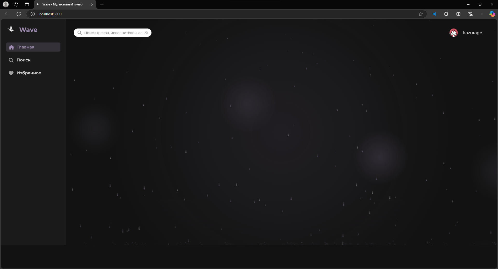

# Wave Music Player

Веб-приложение "Wave" - музыкальный плеер с атмосферным эффектом дождя и визуальной анимацией, реализованный на JavaScript, HTML, CSS с использованием Node.js и Express на сервере.



"Wave" - это современный веб-плеер для прослушивания музыки с уникальным визуальным сопровождением в виде анимированного эффекта дождя. Приложение сочетает в себе функциональный музыкальный плеер и расслабляющий визуальный эффект, создавая особую атмосферу для прослушивания музыки.

## Основные возможности:
- Полнофункциональный музыкальный плеер с управлением треками (воспроизведение, пауза, переключение, повтор, случайный порядок)
- Визуальный эффект дождя с настраиваемой интенсивностью и анимацией
- Интерактивный пользовательский интерфейс с адаптивным дизайном
- Система авторизации и регистрации пользователей
- Персональные плейлисты и избранные треки
- База данных для хранения информации о пользователях и треках
- REST API для управления данными

## Технический стек:
- Frontend: HTML5, CSS3, JavaScript (без фреймворков)
- Backend: Node.js, Express
- База данных: MySQL
- Дополнительные библиотеки: Font Awesome (для иконок)

Приложение имеет модульную архитектуру с четким разделением ответственности между различными компонентами, что делает его легко расширяемым и поддерживаемым.

## Установка и запуск

1. Установите зависимости:

```bash
npm install
```

2. Запустите сервер:

```bash
npm start
```

3. Откройте браузер и перейдите по адресу: http://localhost:3000

